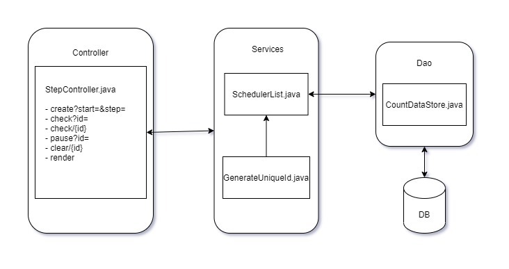
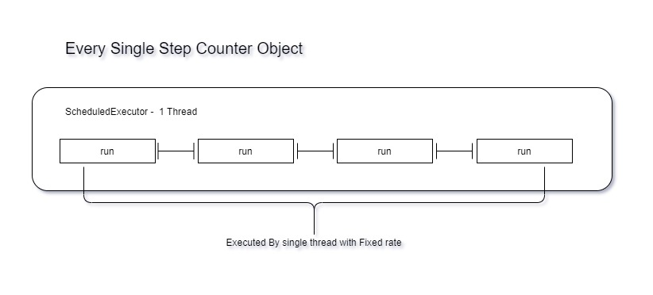
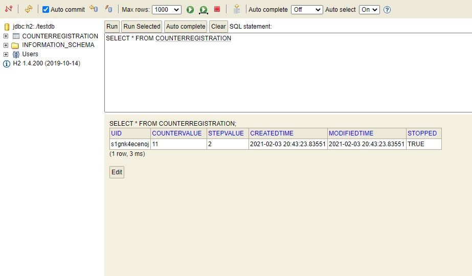

# Step Counting System
The Application implements a REST based API server using Java 8 and Spring Boot. This Application implements scheduled executor to implement a task of creating, checking out, pausing and stopping the counters.

## Starting the Application
The pre-requisite for the application includes following dependencies and the environment variables set properly on your system:
1. Java JDK
2. Maven

To start the application, run the following command
```
$ mvn spring-boot:run
```

## Architecture
I have implemented layered architecture and MVC Pattern which serves below mentioned functions using REST API call.



---

Following functions have been implemented:
1. `_create?start=<startval:integer>, step=<steptime:integer>`
    Result in creation of a new go routine in the program that starts counting every step time seconds. The response should return a unique identifier for that routine.

2. `_check?id=<unique id:string>`
    Returns the current counter value, creation time and step time for that service.

3. `_check`
    Returns same as (2) above but for all the unique identifiers present in the system.

4. `_render`
    Returns an HTML page stating in tabular form, the unique identifiers and their current counts.

5. `_clear/:id or _clear?id=<identifier:string>`
    Clears the timer and cleanly exit setting the service status to stopped.

6. `_pause?id=<identifier:string>`
    Pause a given service if it exists, else return error. If it exists, and is a valid target, change the modifiedAt time to reflect this call’s response.


---
## Scheduler
The scheduler Executors are objects which are stored in Map objects with corresponding keys identifying each step counter's unique identifier.

Now each scheduler executor are services which schedule jobs at fixed rate and produces ScheduledFuture object.



---
## Persistence
I have used H2 Database to make persistence of all the stopped Schedulers which holds data for 


## Reference
1. https://www.journaldev.com/2340/java-scheduler-scheduledexecutorservice-scheduledthreadpoolexecutor-example
2. http://tutorials.jenkov.com/java-util-concurrent/scheduledexecutorservice.html
3. https://docs.spring.io/spring-boot/docs/current/reference/htmlsingle
